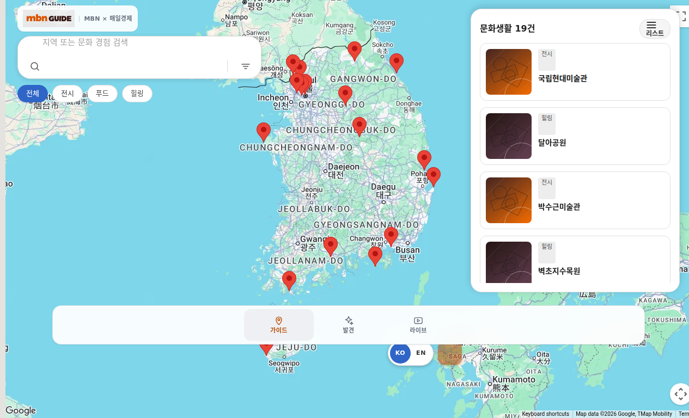
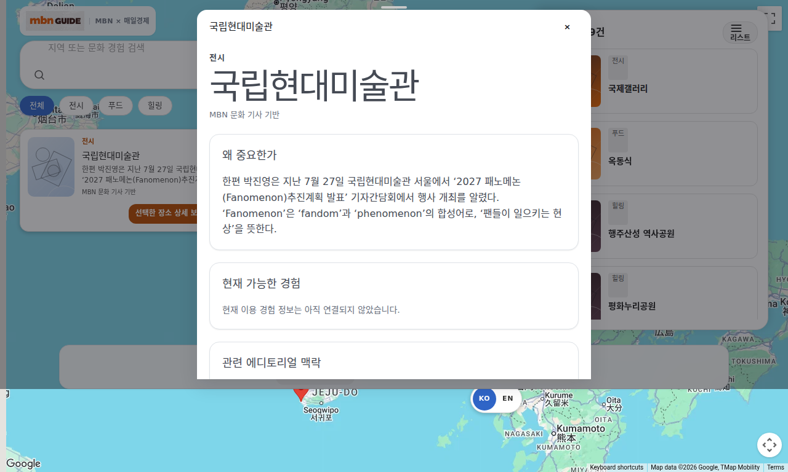
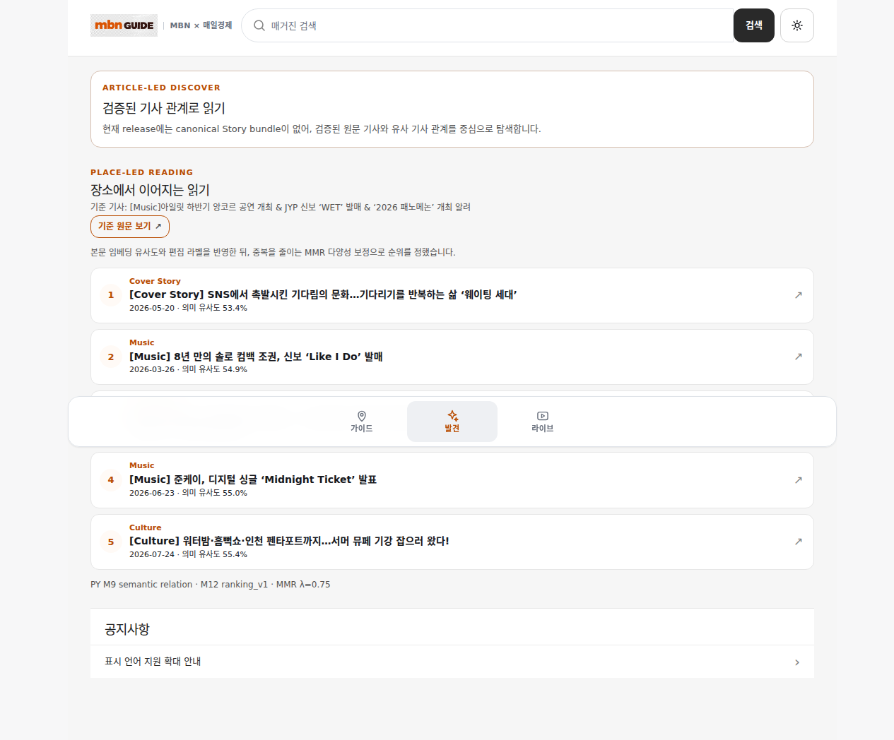
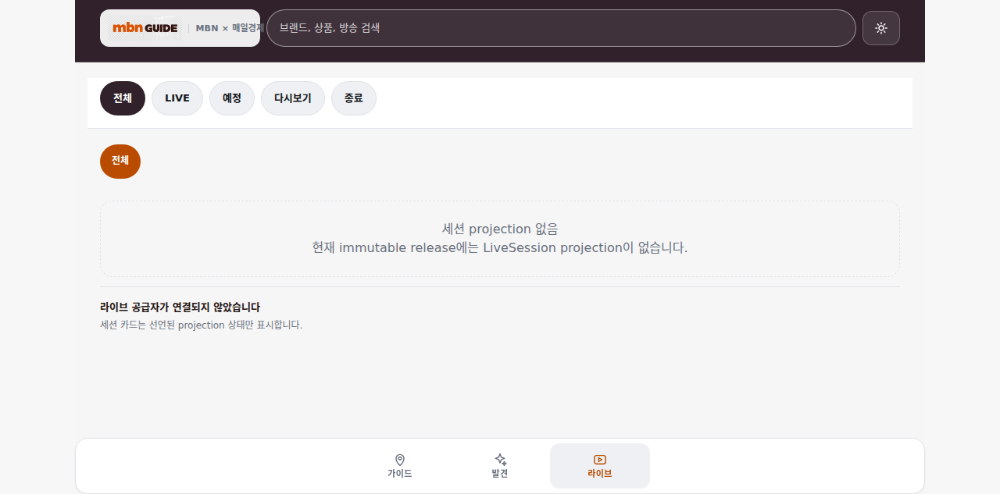
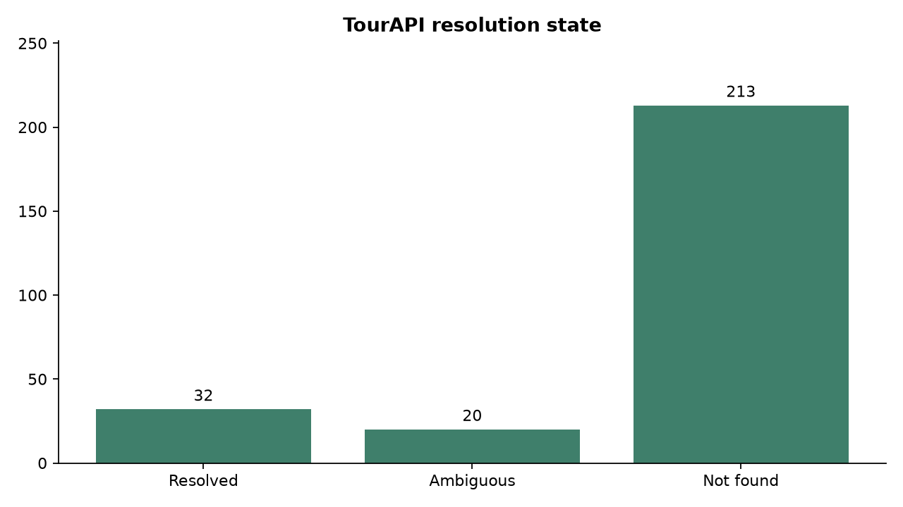
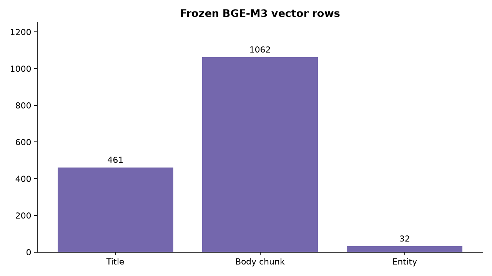
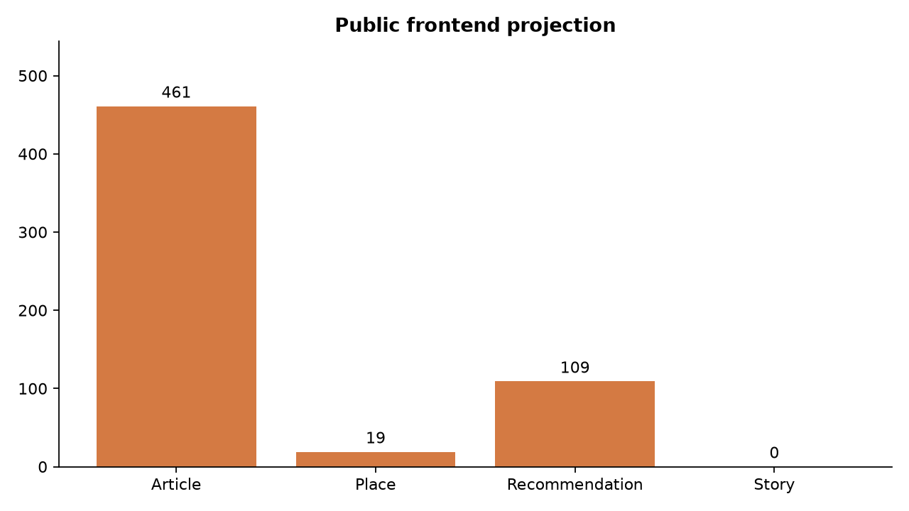

<div align="center">

# MBN GUIDE

### 문화 기사를 장소·맥락·추천으로 바꾸는 Notebook-first 데이터 엔진

**비정형 MBN 기사 → 근거가 남는 장소 검증 → BGE-M3 의미 관계 → 설명 가능한 추천 → immutable frontend release**

[제품 데모](https://mbn-guide-front.vercel.app/) ·
[공개 재현 저장소](https://github.com/Siegfriex/nbm_guide_py) ·
[원천 데이터·ML 저장소](https://github.com/Siegfriex/mbN_GUIDE/tree/nbM_GUIDE_PY) ·
[증거 조정 보고서](reports/EVIDENCE_RECONCILIATION.md)

</div>

---

## 3분 요약

MBN GUIDE는 기사 제목에 등장한 장소를 지도에 찍는 프로젝트가 아닙니다.
기사 본문에서 문화 장소·행사를 찾고, 문맥 증거와 TourAPI 관측을 분리해
검증한 뒤, 고정된 BGE-M3 벡터 공간에서 관련 콘텐츠를 측정하고 제품 계약에
맞는 데이터만 공개 릴리스로 투영한 **위치 기반 문화 데이터 엔진**입니다.

| 공개 검증 지표 | 결과 |
| --- | ---: |
| 분석 기사 | <!-- claim:ARTICLE_COUNT -->461<!-- /claim -->건 |
| TourAPI query / 해결 / 모호 / 미발견 | <!-- claim:M7_PROVIDER_QUERY_COUNT -->265<!-- /claim --> / <!-- claim:M7_RESOLVED_COUNT -->32<!-- /claim --> / <!-- claim:M7_AMBIGUOUS_COUNT -->20<!-- /claim --> / <!-- claim:M7_NOT_FOUND_COUNT -->213<!-- /claim --> |
| BGE-M3 제목 / 본문 chunk / 문화 entity vector | <!-- claim:M8_TITLE_VECTOR_COUNT -->461<!-- /claim --> / <!-- claim:M8_BODY_CHUNK_COUNT -->1062<!-- /claim --> / <!-- claim:M8_ENTITY_VECTOR_COUNT -->32<!-- /claim --> |
| 기사 간 / 기사→entity 의미 관계 | <!-- claim:M9_ARTICLE_RELATION_COUNT -->9220<!-- /claim --> / <!-- claim:M9_ENTITY_RELATION_COUNT -->2305<!-- /claim --> |
| 추천 후보 / 내부 Top-K | <!-- claim:M11_CANDIDATE_COUNT -->13084<!-- /claim --> / <!-- claim:M12_SELECTED_TOPK_COUNT -->7522<!-- /claim --> |
| 제품 투영 Place / 장소 추천 / 관련 기사 | <!-- claim:PROJECTED_PLACE_COUNT -->19<!-- /claim --> / <!-- claim:PROJECTED_RECOMMENDATION_COUNT -->109<!-- /claim --> / <!-- claim:RELATED_ARTICLE_COUNT -->4610<!-- /claim --> |
| StoryBundle / 제품 taxonomy | <!-- claim:STORY_COUNT -->0<!-- /claim --> / <!-- claim:PRODUCT_TAXONOMY_COUNT -->8<!-- /claim --> |

숫자는 README에 따로 관리하지 않습니다. 공개 재현 저장소의
[`portfolio_claims.json`](https://github.com/Siegfriex/nbm_guide_py/blob/agent/portfolio-final-evidence/data/evidence/portfolio_claims.json)과
자동 검사기가 원천 경로·commit·SHA-256까지 대조합니다.

## 실제 제품 화면

아래 이미지는 2026-08-08에 배포 URL을 실제 브라우저로 열어 캡처했습니다.
prototype이 아니라 현재 배포된 화면의 읽기 전용 증거입니다.

| GUIDE — 19개 Place와 지도 | Place — 좌표·설명·MBN provenance |
| --- | --- |
| [](https://mbn-guide-front.vercel.app/guide) | [](https://mbn-guide-front.vercel.app/place/place_0001) |

| DISCOVER — 기사별 관련 콘텐츠 | LIVE — 데이터 미제공 상태를 그대로 표시 |
| --- | --- |
| [](https://mbn-guide-front.vercel.app/discover) | [](https://mbn-guide-front.vercel.app/live) |

배포 JavaScript bundle에는 releaseId `mbn-guide-701011c9608e4524`와
profile `MINIMAL_SAFE_RELEASE_V1_1`이 포함되어 있습니다. route, 캡처 SHA,
bundle SHA는 공개 재현 저장소의
[`vercel_evidence.json`](https://github.com/Siegfriex/nbm_guide_py/blob/agent/portfolio-final-evidence/data/evidence/vercel_evidence.json)에 고정했습니다.

## 문제 정의

문화 기사는 장소명, 행사명, 브랜드, 지역, 작품명이 한 문장에 섞이고 같은
표현도 문맥에 따라 장소가 아닐 수 있습니다. 검색 결과 하나를 바로 지도 pin으로
승격하면 다음 오류가 생깁니다.

- 상품·작품·브랜드를 장소로 오인한다.
- 동명이인·지점·행사를 하나의 object로 합친다.
- 검색 실패를 곧 존재하지 않음으로 오해한다.
- 기사 유사도를 곧바로 사용자 추천 점수로 부른다.
- frontend가 표현하지 못하는 Event나 Article을 Place나 Story로 강제 변환한다.

따라서 이 프로젝트는 정확도 숫자 하나보다 **evidence lineage, grain, 실패 상태,
제품 투영 경계**를 먼저 설계했습니다.

## 데이터에서 제품까지

```text
MBN Article Index / Body
        ↓
정규화 Corpus와 body block
        ↓
문맥 기반 장소·행사 candidate + literal evidence
        ↓
검증 → query promotion → TourAPI ProviderObservation
        ↓
CanonicalPlace / CultureEvent + Article relation
        ↓
고정 BGE-M3 title / body chunk / entity vector
        ↓
exact semantic relation
        ↓
candidate retrieval → context별 ranking → reason evidence
        ↓
contract-safe projection → immutable JSON + manifest/SHA/FK audit
        ↓
GUIDE / DISCOVER / LIVE
```

핵심 추적 단위는 다음과 같습니다.

```text
article → body block → mention → verification
        → provider observation → canonical object → product projection
```

### 1. 수집과 정규화

- `Article Index`는 URL, sourceArticleId, 제목, 발행 시각, section 등 수집
  목록과 identity를 관리합니다.
- `Article Body`는 본문을 deterministic block으로 분리하고 parser version,
  parse status, body hash를 기록합니다.
- 공개 저장소에는 원문 전체를 재배포하지 않고 release-safe metadata, hash,
  provenance와 소수 sample만 둡니다.
- `rawTitle`과 bracket token은 버리지 않지만, 제품 분류의 정답이 아니라 weak
  editorial signal로 취급합니다.

### 2. 장소 후보와 Geo 검증

candidate는 이름만 저장하지 않고 `articleId`, `blockIndex`, literal span,
context, rule reason을 함께 가집니다. 검증된 query만 Provider로 보내고 결과는
다음 상태를 그대로 보존합니다.



| 상태 | 의미 | 공개 기준 |
| --- | --- | ---: |
| `AUTO_RESOLVED` | 독립 검증과 좌표·provenance gate를 통과 | <!-- claim:M7_RESOLVED_COUNT -->32<!-- /claim --> |
| `AMBIGUOUS` | 복수 후보 또는 verifier 불일치 | <!-- claim:M7_AMBIGUOUS_COUNT -->20<!-- /claim --> |
| `NOT_FOUND` | 이번 query/provider에서 식별 실패 | <!-- claim:M7_NOT_FOUND_COUNT -->213<!-- /claim --> |
| `ERROR` | 전송·응답 처리 실패 | 0 |

`ProviderObservation`과 내부 `CanonicalPlace`를 분리했기 때문에 검색 응답이
자동으로 map object가 되지 않습니다. map-eligible object는 유효한 WGS84 좌표,
`whyItMatters`, source article relation과 provenance를 모두 요구합니다.

### 3. 세 taxonomy의 권위 분리

| 층 | 역할 | 사용 원칙 |
| --- | --- | --- |
| MBN editorial label | 제목·편집 맥락의 weak signal | 제품 category나 Human Gold로 승격하지 않음 |
| TourAPI taxonomy | `ContentTypeId`, `lclsSystm1/2/3` | provider 관측과 category evidence로 보존 |
| MBN GUIDE product taxonomy | 공연·전시·음악·푸드·뷰티·패션·방송·미디어·힐링·액티비티 8개 | frontend projection의 유일한 category enum |

요청에 언급된 `신분류체계정보 관광타입정보 연계 정의서.xlsx`는 현재 공개·로컬
증거 위치에서 찾지 못했습니다. 따라서 대분류 이름만으로 완전한 crosswalk를
발명하지 않았고, 실제 source config에 존재하는 규칙만 공개했습니다. 미매핑은
`UNKNOWN` 또는 projection exclusion으로 남깁니다.

### 4. 고정 BGE-M3 벡터 공간

모델은 `BAAI/bge-m3`, revision
`5617a9f61b028005a4858fdac845db406aefb181`, dimension
<!-- claim:M8_EMBEDDING_DIMENSION -->1024<!-- /claim -->로 고정했습니다.



- 제목: <!-- claim:M8_TITLE_VECTOR_COUNT -->461<!-- /claim --> × 1,024
- 본문 chunk: <!-- claim:M8_BODY_CHUNK_COUNT -->1062<!-- /claim --> × 1,024
- 문화 entity: <!-- claim:M8_ENTITY_VECTOR_COUNT -->32<!-- /claim --> × 1,024
- NaN / Inf / zero vector / metadata mismatch: 모두 0

M9에서는 vector를 다시 만들지 않고 BLAS matrix multiplication으로 cosine
matrix를 한 번 계산했습니다. 기사 본문 유사도는 다음 BODY_ONLY recipe입니다.

```text
BodySim(i, j) = 0.70 × max(chunk-pair cosine)
              + 0.30 × mean(top-3 chunk-pair cosine)
```

25-query direct-geo Silver 평가에서 Recall@5
<!-- claim:M9_BODY_RECALL_AT_5 -->1.0<!-- /claim -->, MRR
<!-- claim:M9_BODY_MRR -->0.8966666666666666<!-- /claim -->였습니다. 이는 Human
relevance Gold가 아니라 recipe 선택을 위한 제한된 weak benchmark입니다.

### 5. 유사도·후보·순위의 분리

| 단계 | grain | 하는 일 | 하지 않는 일 |
| --- | --- | --- | --- |
| M9 의미 관계 | article→article / article→entity | exact Top-K semantic measurement | 사용자 추천 점수라고 부르지 않음 |
| M11 candidate retrieval | context-target | semantic·direct·shared entity·geo union과 eligibility | global final score 없음 |
| M12 ranking | candidate | candidate set별 feature normalization, MMR, reason | 인기·개인화·sponsored boost 없음 |
| M13/M14 projection | frontend object | enum·FK·locale·reason·manifest gate | unsupported type 강제 변환 없음 |

missing feature는 0점이 아닙니다. 사용 가능한 feature의 가중치 합으로 다시
정규화하므로 `missing temporal`과 `temporalScore=0`의 의미를 보존합니다.
추천 reason도 LLM 문구가 아니라 `NEARBY`, `ARTICLE_RELATED`, `MBN_CONNECTED`
같은 구조화 evidence에서 결정합니다.

### 6. 안전한 제품 릴리스



M12 내부 Top-K <!-- claim:M12_SELECTED_TOPK_COUNT -->7522<!-- /claim -->건을 모두
JSON으로 밀어 넣지 않았습니다. frontend enum과 FK가 맞는 Place→Place 추천
<!-- claim:PROJECTED_RECOMMENDATION_COUNT -->109<!-- /claim -->건만
`recommendations.json`에 넣고, Article→Article 관계
<!-- claim:RELATED_ARTICLE_COUNT -->4610<!-- /claim -->건은 별도 계약으로
투영했습니다. Event→Place, Article→Story coercion은 0입니다.

공개 release는 파일별 row count, bytes, SHA-256을 가진 manifest로 잠급니다.
공개 재현 Notebook은 manifest를 신뢰만 하지 않고 독립 재계산합니다.

## 제품 객체와 데이터 엔진의 연결

| Surface | 현재 실제 지원 | 현재 제외·미구현 |
| --- | --- | --- |
| GUIDE | Place 19곳, 좌표, category, `whyItMatters`, provenance, 장소 추천 109건 | Event 7건은 frontend Event schema가 없어 제외 |
| DISCOVER | Article 461건, 관련 기사 관계 4,610건, 기사↔장소 맥락 | canonical StoryBundle producer 없음 |
| LIVE | unavailable state와 제품 계약 경계 | LiveSession·Offer provider/backend는 검증 release 범위 밖 |

## 직접 재현하기

공개 재현은 이 인덱스가 아니라 별도 저장소에서 수행합니다.

```bash
git clone https://github.com/Siegfriex/nbm_guide_py.git
cd nbm_guide_py
git switch agent/portfolio-final-evidence

python3 -m venv .venv
. .venv/bin/activate
pip install -r requirements.txt

python scripts/run_notebooks.py
pytest
PYTHONPATH=src python scripts/verify_public_snapshot.py
PYTHONPATH=src python scripts/check_readme_claims.py
python scripts/check_no_secrets.py
python scripts/check_links.py
```

| Notebook | 독립 확인 내용 |
| --- | --- |
| `00공개스냅샷검증.ipynb` | manifest bytes/SHA/rows, PK/FK, 좌표 |
| `01장소검증과지오코딩증거.ipynb` | resolved/ambiguous/not-found와 provenance |
| `02임베딩과의미관계검증.ipynb` | 고정 model contract와 BODY_ONLY 수식 |
| `03추천순위화재현.ipynb` | available-feature normalization과 contribution |
| `04릴리스무결성검증.ipynb` | release payload·gate·secret 공개 범위 |

이 저장소만 clone해도 raw 기사, Provider cache, embedding 전체 vector 없이
공개 claim과 핵심 수식을 실행할 수 있습니다.

## 설계 선택과 막은 오류

1. Index와 Body를 분리해 수집 identity와 parser failure를 혼동하지 않았습니다.
2. bracket token을 보존하되 weak signal로 제한해 편집 형식을 taxonomy로 오인하지 않았습니다.
3. mention을 곧바로 pin으로 만들지 않아 false venue와 동명 장소 승격을 막았습니다.
4. `AMBIGUOUS / NOT_FOUND / ERROR`를 삭제하지 않아 provider 품질을 과장하지 않았습니다.
5. Provider object와 Canonical object를 분리해 외부 관측과 내부 진실을 구분했습니다.
6. TourAPI taxonomy와 product taxonomy를 분리해 category fabrication을 막았습니다.
7. BGE-M3 revision을 고정해 실행 시점별 vector drift를 막았습니다.
8. title/body recipe를 benchmark해 모델을 다시 학습하지 않고 representation을 선택했습니다.
9. NxN similarity를 추천이라고 부르지 않고 측정과 제품 선택을 분리했습니다.
10. retrieval과 ranking을 분리해 후보 누락과 score 결정을 독립 감사했습니다.
11. missing feature mask로 데이터 부재를 낮은 선호로 오해하지 않았습니다.
12. reason evidence를 보존해 추천 문구의 근거를 추적할 수 있게 했습니다.
13. unsupported Event를 Place로 바꾸지 않아 frontend FK와 의미를 지켰습니다.
14. Story가 없을 때 `stories=[]`를 유지해 가짜 editorial object를 만들지 않았습니다.
15. immutable releaseId와 SHA-256 manifest로 데이터 handoff를 재현 가능하게 했습니다.

상세 근거는 공개 재현 저장소의
[기술적 의사결정](https://github.com/Siegfriex/nbm_guide_py/blob/agent/portfolio-final-evidence/docs/TECHNICAL_DECISIONS.md),
[Taxonomy 권위](https://github.com/Siegfriex/nbm_guide_py/blob/agent/portfolio-final-evidence/docs/TAXONOMY_AUTHORITY.md),
[TourAPI 근거](https://github.com/Siegfriex/nbm_guide_py/blob/agent/portfolio-final-evidence/docs/TOURAPI_EVIDENCE.md)를 참조하십시오.

## 공개 범위와 한계

- StoryBundle producer가 없어 `stories=[]`입니다.
- CultureEvent 7건은 frontend Event schema가 없어 Place로 변환하지 않았습니다.
- 콘텐츠 locale은 한국어 중심이고 공개 Place의 EN locale은 없습니다.
- M10의 58개 editorial label은 Human Gold나 제품 taxonomy가 아닙니다.
- BODY_ONLY 평가는 25-query Silver, shared-geo 평가는 3-query low-evidence scope입니다.
- 추천 relevance는 human relevance Gold로 최적화한 production model이 아닙니다.
- raw MBN 본문·HTML, Provider raw response, 전체 vector, credential은 공개하지 않습니다.
- commerce, LiveSession, Offer backend의 완성을 주장하지 않습니다.
- 로컬 M15 1년 확장 checkpoint는 공개 검증 release가 아니므로 주요 성과에서 제외했습니다.

이 한계는 실패를 숨기기 위한 문구가 아니라 **어디까지가 관측 사실이고 어디부터가
아직 검증되지 않은 주장인지 고정하는 Evidence Policy**입니다.

## 저장소 역할

| 저장소 | 역할 | 수정 권위 |
| --- | --- | --- |
| [`mbN_GUIDE`](https://github.com/Siegfriex/mbN_GUIDE/tree/nbM_GUIDE_PY) | Algorithm/Data SSOT, M0–M14 producer | 이번 작업에서 읽기 전용 |
| [`nbm_guide_py`](https://github.com/Siegfriex/nbm_guide_py/tree/agent/portfolio-final-evidence) | sanitized release, Claim Registry, 5개 Notebook, 자동 QA | 공개 재현·감사 계층 |
| [`nbm_guides`](https://github.com/Siegfriex/nbm_guides) | 채용 담당자용 프로젝트 인덱스 | 서사·시각 증거·navigation |
| [Vercel](https://mbn-guide-front.vercel.app/) | GUIDE/DISCOVER/LIVE 실제 배포 UI | 읽기 전용 시각 증거 |

## 증거 조정

공개 source branch는 `09a0598`, 로컬 source HEAD는 후속 M14R1/M15 작업을
포함한 `69cb899`였습니다. 최신 release build commit 자체가 공개 source
branch에 없다는 점을 숨기지 않았습니다. 대신 release source lineage
`afe4d57`, sanitized release bytes, gate, Vercel bundle을 공개 증거로 묶었습니다.
세부 claim별 판단과 SHA-256은
[`reports/EVIDENCE_RECONCILIATION.md`](reports/EVIDENCE_RECONCILIATION.md)에 있습니다.

## 데이터 이용 고지

MBN 기사 원문을 재배포하지 않으며 metadata/hash/provenance만 공개합니다.
TourAPI service key와 raw response는 제외하고, 공개 이미지 사용 시
`cpyrhtDivCd` 등 저작권 유형을 확인합니다. 자세한 내용은
[`DATA_NOTICE.md`](DATA_NOTICE.md)를 확인하십시오.

<details>
<summary>제품 디자인 prototype 보기</summary>

아래는 실제 배포 캡처와 구분되는 초기 UI/UX prototype입니다.

| 1 | 2 |
| --- | --- |
|  |  |

| 3 | 4 |
| --- | --- |
|  |  |

</details>

---

**최종 소구:** 이 프로젝트의 결과는 “BGE-M3를 사용했다”가 아니라,
**문화 기사 한 건이 지도 Place와 추천으로 바뀌는 모든 판단을 evidence와 hash로
되짚을 수 있게 만들고, 제품이 표현할 수 없는 데이터는 억지로 출시하지 않은 것**입니다.
