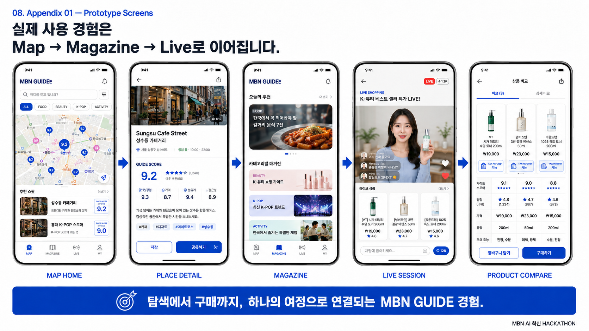
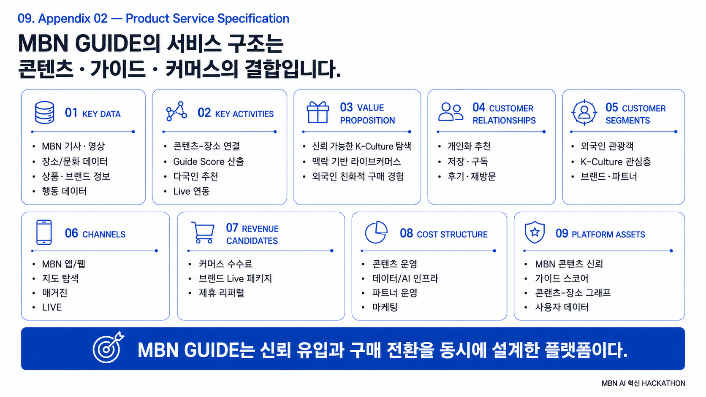
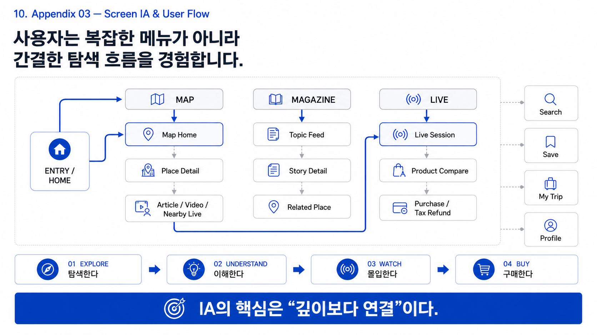
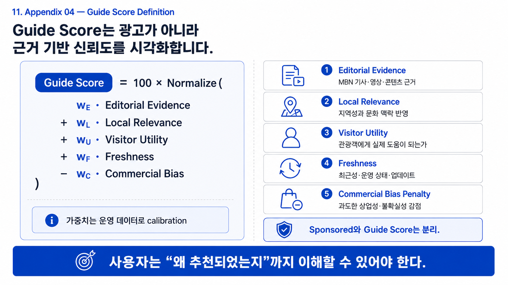
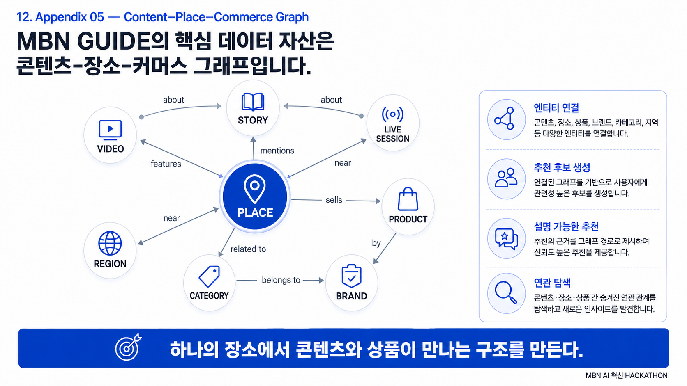
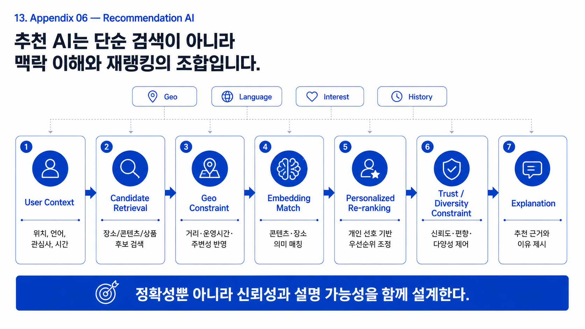
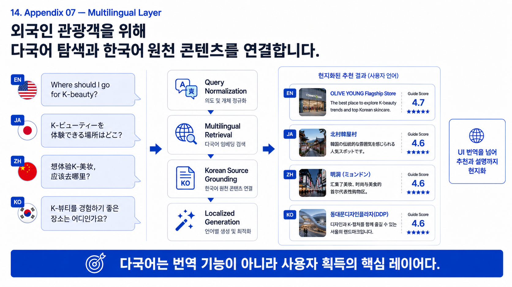
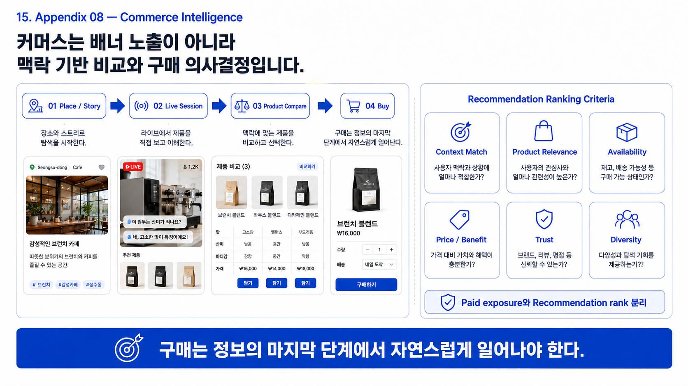
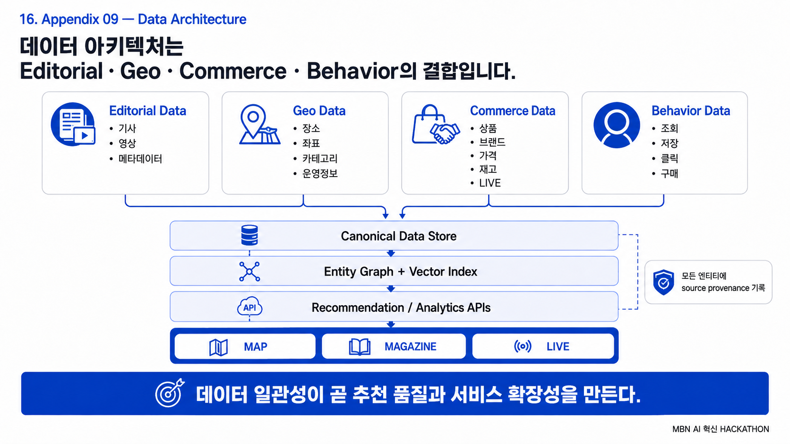
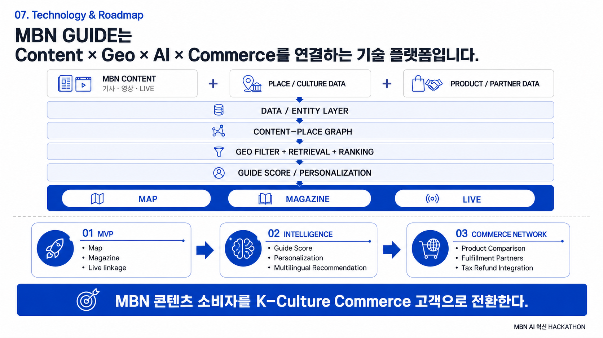

<div align="center">

**Data & AI**

[](https://www.python.org/) [](https://pandas.pydata.org/) [](https://arrow.apache.org/) [](https://duckdb.org/) [](https://scikit-learn.org/) [](https://huggingface.co/docs/transformers/) [](https://jupyter.org/)

**Frontend & QA**

[](https://react.dev/) [](https://www.typescriptlang.org/) [](https://vite.dev/) [](https://playwright.dev/) [](https://github.com/)

# MBN GUIDE

### Discover Korea. Understand the Culture. Act with Confidence.

**K-Culture Discovery → Context → Trust → Live Commerce**

외국인 관광객과 낯선 지역의 방문자가 한국의 장소와 문화를 발견하고, MBN 콘텐츠로 그 맥락을 이해한 뒤, LIVE·Offer·Partner Action으로 자연스럽게 이어지도록 설계한 **Location-based Culture Commerce Platform**입니다.

**MBN AI 혁신 HACKATHON · Business Track**

홍익대학교 9팀<br>
조재혁 · 장민진 · 허재원 · 류지환 · 이서윤

[Product](#product-thesis) ·
[Experience](#product-experience) ·
[AI &amp; Data](#intelligence-layer) ·
[Architecture](#technology-architecture) ·
[Release](#current-data-release) ·
[Status](#current-development-status) ·
[Roadmap](#roadmap)

</div>

---

## Prototype Screens

제공된 화면 자료를 원본 디렉터리 순서 그대로 수록했습니다. 이 이미지는 제품 방향과 인터랙션 가설을 설명하는 **프로토타입/컨셉 화면**이며, 결제·재고·Tax Refund·파트너 연동이 현재 운영 중이라는 뜻은 아닙니다.





















> **Project thesis** — MBN 콘텐츠의 신뢰도를 위치 기반 K-Culture Discovery로 확장하고, 그 신뢰를 Live Commerce의 전환 기반으로 연결합니다.

## Why MBN GUIDE

K-Culture 경험을 찾는 과정은 지도, SNS, 기사, 영상, 예약 서비스에 흩어져 있습니다. 사용자는 무엇을 가야 할지뿐 아니라, 그 선택을 왜 믿어도 되는지를 다시 판단해야 합니다.

| 현재 문제 | 사용자 결과 |
| --- | --- |
| SNS·지도·기사·영상에 정보가 분산 | 탐색 비용 증가 |
| 광고·리뷰·추천의 신뢰도 판단이 어려움 | 방문 실패 위험 |
| 콘텐츠와 구매·예약이 분리 | 관심이 행동으로 이어지지 않음 |

**K-Live Commerce의 문제는 LIVE 화면보다 먼저 시작됩니다. 신뢰 가능한 유입이 먼저 필요합니다.**

## Product Thesis

```text
DISCOVER → CONTEXT → TRUST → INTENT → ACTION
```

| Primary surface | 사용자가 얻는 답 | 역할 |
| --- | --- | --- |
| **GUIDE** | 지금 어디를 경험해야 하는가? | 장소 발견 |
| **DISCOVER** | 왜 이곳이 중요한가? | MBN 콘텐츠 기반 맥락·신뢰 |
| **LIVE** | 다음 행동은 무엇인가? | Live context와 Offer·Partner action |

Search, Saved, Language, Profile, Settings는 이 세 경험을 보조하는 Utility Layer입니다.

## Current Data Release

현재 데이터 레이어가 만든 가장 최근의 immutable frontend bundle은 **`mbn-guide-dc9f6a80d54985d6`**입니다. 이 수치는 제품 전체 시장 규모나 라이브 서비스의 운영 수치가 아니라, 해당 release manifest에 기록된 projection의 행 수입니다.

| Export artifact | Rows | Frontend purpose |
| --- | ---: | --- |
| `places.json` | 19 | GUIDE의 canonical place projection |
| `articles.json` | 461 | 콘텐츠 맥락과 source-article metadata |
| `recommendations.json` | 109 | typed, evidence-aware relation output |
| `stories.json` | 0 | 이번 minimal release에서는 미생성 |
| `taxonomy.json` | 8 | category/taxonomy projection |
| `quality_report.json` | 1 | release-level quality summary |

Release profile은 `MINIMAL_SAFE_RELEASE_V1`이며, schema version은 `frontend_release_v2.1_minimal_safe`입니다. M13은 `M13_RELEASE_BUILT_WITH_WARNINGS`, 이후 M14는 `FRONTEND_READY`와 `PASS_WITH_WARNINGS`를 기록했습니다.

## Product Experience

### GUIDE — Discover

Location·category·place를 중심으로 문화 경험 후보를 발견합니다. 장소는 단순 핀이 아니라, 근거를 가진 문화 객체로 다룹니다.

### DISCOVER — Understand

기사·스토리·영상 맥락을 통해 장소와 문화 경험의 의미를 이해합니다. 추천의 출처와 관계를 추적할 수 있도록 provenance를 유지합니다.

### LIVE — Act

Live·Replay·Offer·Partner action을 한 흐름에 놓습니다. 현재 제품 범위는 실제 결제를 주장하지 않고, 검증된 경우에만 outbound action을 제공하는 방향입니다.

## Why MBN

MBN GUIDE의 차별점은 장소를 새로 만들어 내는 것이 아니라, MBN 콘텐츠가 이미 가진 문화적 맥락과 신뢰 신호를 발견 경험으로 재구성하는 데 있습니다.

```text
MBN Article · Video · Live
          +
Place / Culture Data
          ↓
Contextual discovery with provenance
          ↓
Trustworthy intent for later action
```

## Intelligence Layer

```text
MBN CONTENT                         PLACE / CULTURE DATA
Article · Video · Live              Entity · Area · Event
        \                                  /
         └──── Canonical Data / Entity Layer ────┘
                              ↓
                    Content–Place Graph
                              ↓
 Geo Filter → Candidate Retrieval → Semantic Matching → Ranking
                              ↓
                   Explanation / Provenance
                              ↓
                   GUIDE · DISCOVER · LIVE
```

추천 결과가 있더라도 점수만 노출하는 것이 아니라, 어떤 콘텐츠·장소 관계에서 나온 결과인지 설명 가능한 형태로 보존하는 것이 데이터 레이어의 원칙입니다.

### What the data layer preserves

| Object | Producer responsibility | Consumer-safe output |
| --- | --- | --- |
| Article | Stable identity, cleaned title, body/block evidence, provenance | Article metadata and contextual references |
| Culture entity | Candidate normalization, type separation, source evidence | Place projection with category and availability state |
| Relation | Article↔entity evidence, reason code, confidence boundary | Typed relation / recommendation target |
| Provider observation | External response isolated from canonical object | Eligibility/provenance state only when approved |
| Embedding input | Hashed title/body chunks and explicit eligibility | No vector is implied by an input artifact |

`BAAI/bge-m3` is recorded in the current bundle manifest as the embedding model reference. That manifest field is lineage metadata; it does not claim an online embedding service or consumer-side vector search.

## Discovery-to-Commerce Flow

```text
PLACE DISCOVERY
       ↓
MBN CONTENT CONTEXT
       ↓
TRUST / INTENT
       ↓
LIVE CONTEXT
       ↓
VALIDATED OUTBOUND ACTION
```

현재 제품 사실로 다루는 범위는 **Discovery · Content Context · Recommendation · Live Context · Outbound Action**입니다. Commerce partner, fulfillment, tax refund, reservation, payment는 검증과 계약이 필요한 확장 가설입니다.

## Prototype / Product Screens

제품 구현은 GUIDE, DISCOVER, LIVE와 상세·검색·저장·설정 화면으로 분리되어 있습니다. 이 인덱스 저장소에는 출처와 사용 권한이 확인된 화면 자산만 게시합니다. 현재는 UI 소스와 검증 근거를 아래 FRONT 브랜치에서 확인할 수 있습니다.

- [Frontend runtime — `nbM_GUIDE_FRONT`](https://github.com/Siegfriex/mbN_GUIDE/tree/nbM_GUIDE_FRONT)
- [Product and data contract — `nbM_GUIDE_DOCS`](https://github.com/Siegfriex/mbN_GUIDE/tree/nbM_GUIDE_DOCS)

## Technology Architecture

| Layer | Responsibility |
| --- | --- |
| Product contract | Surface, lifecycle, provenance, provider boundary를 문서 SSOT로 고정 |
| Frontend | React/Vite/TypeScript 기반 projection consumer와 GUIDE·DISCOVER·LIVE runtime |
| Data foundation | Parquet·JSON·DuckDB 중심의 local-first canonical artifacts |
| Intelligence | Collection, parsing, geo, text, analysis, validation 책임 단위 |
| Release | Immutable manifest, hash, FK, schema, quality gate를 거친 frontend projection |

```text
raw → processed → geo → semantic → recommendation → quality → exports
```

Provider observation은 canonical place와 구분하며, 외부 Provider의 raw 응답이나 내부 score를 Frontend display contract로 직접 넘기지 않습니다.

## Data & AI Pipeline

| Milestone | Scope | Current evidence |
| --- | --- | --- |
| M7 | Geo / place-event resolution | Canonical entities, evidence, query-ready boundary |
| M8 | Local embedding input and execution boundary | Embedding artifacts and provenance |
| M9 | Semantic relation preparation | Typed semantic relations |
| M10 | Classification | Explicit labels and validation |
| M11 | Candidate retrieval | Candidate generation and retrieval QA |
| M12 | Recommendation ranking | Ranked relations with retained provenance |
| M13 | Immutable frontend bundle | Versioned projection + manifest + hashes |
| M14 | Frontend release validation | Schema, FK, manifest, coordinate and secret-leak gates |

The producer line is intentionally local-first. API input queues and embedding inputs are prepared as artifacts; provider execution, vectors, and consumer delivery are promoted only through their own gates.

### Release gate evidence

| Gate | Result in latest release evidence |
| --- | --- |
| Projected places / articles | 19 / 461 |
| Broken foreign keys | 0 |
| Invalid coordinates | 0 |
| Missing `whyItMatters` | 0 |
| Missing relation reason | 0 |
| Silent recommendation loss | 0 |
| Schema errors / duplicate IDs | 0 / 0 |
| Manifest mismatch / hash mismatch | 0 / 0 |
| Secret leak | 0 |

## Current Development Status

The latest validated producer evidence is an immutable release candidate: `mbn-guide-dc9f6a80d54985d6`.

| Item | Current state |
| --- | --- |
| Frontend projection | 19 places · 461 articles · 109 recommendations · 8 taxonomy entries |
| M13 release build | Built with documented warnings |
| M14 validation | `FRONTEND_READY` / `PASS_WITH_WARNINGS` |
| Structural gates | Schema, FK, duplicate ID, manifest/hash, invalid coordinate and secret-leak checks passed |
| Story projection | 0 rows in this release; not represented as a completed content surface |
| Runtime integration | A validated producer bundle is not the same as a deployed consumer ingress; Frontend release ingestion and coordinate consumption remain integration work |

This status is intentionally narrower than a production-launch claim. It records evidence for a data release, not payment completion, inventory, partner endorsement, or a fully deployed commerce service.

## Validation & QA

Every promoted release is expected to retain:

- immutable release ID, source commit, manifest and SHA-256 checks;
- record counts and schema versions;
- foreign-key, duplicate, coordinate, taxonomy and provenance checks;
- relation evidence and reason codes where a recommendation or source-article link is produced;
- explicit quality verdicts and warnings rather than silent fallback.

The current M14 gate verified the bundle’s schema, duplicate IDs, foreign keys, coordinate validity, manifest/hash integrity and secret-leak rules. A passing structural gate is still not treated as evidence of a live external Provider, a consumer deployment, or business performance.

### Frontend handoff boundary

The release is a producer-side contract bundle. A complete real-product handoff additionally needs Frontend ingress that loads an approved immutable bundle, consumes canonical coordinates rather than fixture positions, and renders real relation provenance without reclassifying it as fixture data. This is an integration batch, not an inference that the existing prototype has already deployed those capabilities.

## Business Model Hypotheses

| Current product boundary | Expansion hypothesis |
| --- | --- |
| Contextual discovery | Commerce partner integrations |
| Provenance-aware recommendation | Reservation and fulfillment |
| Live context | Validated payment flows |
| Outbound action | Tax-refund and post-purchase services |

These are hypotheses, not claims of existing partners, revenue, inventory, payment, or fulfillment capability.

## Repository / Branch Guide

`main` in this repository is an **IR / portfolio landing / repository index**. It does not merge implementation lines into a single codebase.

| Branch | Role |
| --- | --- |
| [`main`](https://github.com/Siegfriex/nbm_guides) | Integrated portfolio landing and repository index |
| [`nbM_GUIDE_DOCS`](https://github.com/Siegfriex/mbN_GUIDE/tree/nbM_GUIDE_DOCS) | Product and data-contract SSOT |
| [`nbM_GUIDE_FRONT`](https://github.com/Siegfriex/mbN_GUIDE/tree/nbM_GUIDE_FRONT) | UI/UX runtime |
| [`nbM_GUIDE_PY`](https://github.com/Siegfriex/mbN_GUIDE/tree/nbM_GUIDE_PY) | Data/AI producer development line |
| `nbM_GUIDE_PY_M7_GEO` | Geo checkpoint |
| `nbM_GUIDE_PY_M8_EMBEDDING` | Embedding checkpoint |
| `nbM_GUIDE_PY_M9_SEMANTIC` | Semantic checkpoint |
| `nbM_GUIDE_PY_M10_CLASSIFICATION` | Classification checkpoint |
| `nbM_GUIDE_PY_M11_CANDIDATES` | Candidate retrieval checkpoint |
| `nbM_GUIDE_PY_M12_RANKING` | Recommendation-ranking checkpoint |
| `nbM_GUIDE_PY_M13_RELEASE` | Immutable frontend-release checkpoint |
| `nbM_GUIDE_PY_M14_FRONTEND_READY` | Frontend-consumable release validation checkpoint |

## Documentation

The normative pre-implementation contract is maintained in the DOCS line:

| Document | Purpose |
| --- | --- |
| `00_PRODUCT_CONSTITUTION` | Product principles and primary surfaces |
| `01_PRD` | Product requirements |
| `02_IA_USER_FLOW` | Information architecture and user flows |
| `03_FEATURE_SPEC` | Feature boundaries |
| `04_CONTENT_DATA_CONTRACT` | Content, entity, relation and Provider boundaries |
| `05_BUSINESS_HYPOTHESIS` | Commercial assumptions and validation targets |
| `06_TECHNICAL_ARCHITECTURE_CONSTRAINTS` | Implementation constraints |
| `07_DECISION_LOG` | Accepted and open decisions |

See the [DOCS branch](https://github.com/Siegfriex/mbN_GUIDE/tree/nbM_GUIDE_DOCS) for the current source files and their decision status.

## Roadmap

```text
Validated data release
        ↓
Frontend release ingress + real coordinate consumption
        ↓
Story / content projection coverage
        ↓
Provider-backed geo resolution under approved boundary
        ↓
Embedding and semantic serving under explicit execution gate
        ↓
Commerce action integrations with partner, disclosure and capability evidence
```

## Scope & Disclosure

- This repository is a portfolio index, not a production deployment claim.
- Fixture, prototype, validator, or structural-release evidence is not represented as empirical business performance.
- No partnership, revenue, tax-refund, payment, reservation, inventory, or fulfillment claim is made without separate evidence and authorization.
- Provider data remains an external boundary; local canonical data and Provider observations must not be silently conflated.

## Team / License

MBN AI 혁신 HACKATHON · Business Track — 홍익대학교 9팀.

License and third-party asset terms will be published when the repository contains distributable source or media assets.
